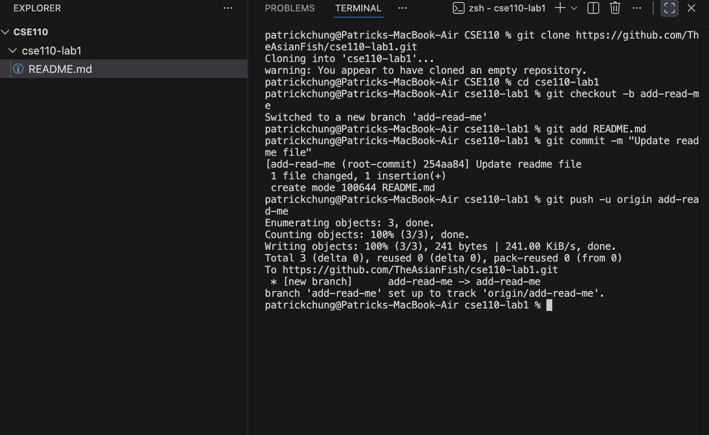

# Patrick Chung

## About Me
Hello! My name is Patrick Chung, and this is my GitHub user page.

I am a programmer interested in **software engineering**, *machine learning*, and building real systems that people can use.

> I like learning by building projects and figuring out how systems work end to end.
> I love collaborating with other passionate engineers and programmers.
> I love dogs.

## Programmer Profile
Some things I enjoy working on:
- Full-stack applications
- Backend systems
- APIs
- Machine learning projects
- Cloud and deployment workflows

### Favorite Programming Languages
1. Python
2. JavaScript
3. C#
4. SQL

My favorite programming language is **Python** because it is flexible and fast to build with.

## Skills and Tools
Some tools and technologies I have used:
- Git and GitHub
- VS Code
- React
- Flask
- PostgreSQL
  
## Code I Like
Here is a short code example:

```python
def greet(name):
    return f"Hello, {name}!"
```

Here is an inline code example: `git status`

## Links

### External Link
Here is a link to [GitHub](https://github.com).

### Section Links
Jump to another section in this file:
- [Go to Pictures](#pictures)
- [Go to Tasks](#tasks)

### Relative Links
Here is a relative link to my [README.md](README.md).

Here is a relative link to an image file in my repo: [View command line screenshot](screenshots/git_commands.png)

## Pictures
Here is an embedded image from my repository:



## Tasks
- [x] Create repository
- [x] Clone repository
- [x] Use Git on the command line
- [x] Use Git in VS Code
- [x] Create a Markdown user page
- [ ] Continue improving my GitHub profile

## Closing
Thanks for visiting my page.